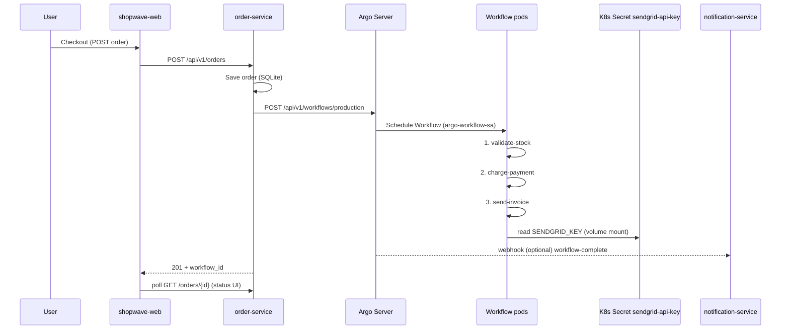

# ShopWave on Kubernetes

Manifests deploy the three application services into the **`production`** namespace. [Argo Workflows](https://argo-workflows.readthedocs.io/) must be installed separately (typically in an `argo` namespace) — this repo does not install Argo itself.

## Layout

```
k8s/
├── namespace.yaml
├── kustomization.yaml
├── secrets/
│   ├── sendgrid-api-key.yaml    # mounted into workflow send-invoice step
│   └── argo-api-token.yaml      # order-service → Argo Server API
├── rbac/
│   ├── argo-workflow-sa.yaml           # SA + Role for workflow pods (secrets:get)
│   └── order-service-argo-submit.yaml  # SA + Role for order-service → create workflows
├── order-service/
├── shopwave-web/
├── notification-service/
└── argo/
    ├── workflow-order-placed.yaml       # reference Workflow CR (same as workflow.py)
    └── workflow-webhook-configmap.yaml  # webhook URL notes
```

## Deploy on Minikube (local)

**→ [MINIKUBE.md](MINIKUBE.md)** — full step-by-step: start cluster, build images, install Argo, apply manifests, port-forwards, verification.

## Publish images (GHCR)

GitHub Actions workflow [`.github/workflows/publish-ghcr.yml`](../.github/workflows/publish-ghcr.yml) builds and pushes all three services on push to `main`/`master`, tags `v*`, or **workflow_dispatch**.

| Image | Example tag |
|-------|-------------|
| `ghcr.io/<owner>/shopwave-order-service` | `latest`, branch name, git SHA |
| `ghcr.io/<owner>/shopwave-shopwave-web` | same |
| `ghcr.io/<owner>/shopwave-notification-service` | same |

1. Enable **Settings → Actions → Workflow permissions → Read and write**.
2. Push to `main` or run the workflow manually (**Actions → Publish to GHCR → Run workflow**).
3. Set **Packages** visibility (public repo → link package to repo for public pulls).
4. Update `image:` in `k8s/*/deployment.yaml` (or a Kustomize overlay) to the `ghcr.io/...` URLs.
5. **Private packages:** create `kubectl create secret docker-registry ghcr-login --docker-server=ghcr.io ...` and set `imagePullSecrets` on deployments.

```bash
echo "$GITHUB_TOKEN" | docker login ghcr.io -u YOUR_GITHUB_USER --password-stdin
```

## Prerequisites

1. Kubernetes cluster (kind, minikube, EKS, etc.)
2. **Argo Workflows** installed with a reachable API server  
   Default in manifests: `argo-server.argo.svc.cluster.local:2746`
3. Container images built and available to the cluster:

```bash
docker compose build
# kind example:
kind load docker-image shopwave-order-service:latest
kind load docker-image shopwave-shopwave-web:latest
kind load docker-image shopwave-notification-service:latest
```

4. **Argo Workflows** installed with API reachable from the cluster (see [MINIKUBE.md §4](MINIKUBE.md#4-install-argo-workflows) — use `--auth-mode=client` for ServiceAccount tokens).
5. `secrets/sendgrid-api-key.yaml` can stay as the workshop placeholder unless you need a real key.

## Deploy

```bash
kubectl apply -k k8s/
kubectl -n production get pods
```

Port-forward for local access:

```bash
kubectl -n production port-forward svc/shopwave-web 3000:80
kubectl -n production port-forward svc/order-service 8080:8080
kubectl -n production port-forward svc/notification-service 3001:3000
```

---

## Create `ARGO_TOKEN`

ShopWave does **not** generate this token in code. After `kubectl apply -k k8s/`, you mint a Kubernetes JWT for ServiceAccount **`order-service-argo`** and store it in Secret **`argo-api-token`**. The order-service pod reads it as env **`ARGO_TOKEN`** and sends it as `Authorization: Bearer …` to the Argo Server API.

### How it fits together

```
order-service-argo (ServiceAccount)
        │
        │  kubectl create token order-service-argo
        ▼
   JWT (bound to that SA)
        │
        │  kubectl patch secret argo-api-token
        ▼
Secret key "token" = "Bearer <jwt>"
        │
        │  deployment secretKeyRef → ARGO_TOKEN
        ▼
order-service → POST /api/v1/workflows/production
```

| Artifact | File / command | Purpose |
|----------|----------------|---------|
| RBAC | `rbac/order-service-argo-submit.yaml` | SA `order-service-argo` may **create** `workflows` in `production` |
| Placeholder secret | `secrets/argo-api-token.yaml` | Applied as `Bearer REPLACE_WITH_ARGO_API_TOKEN` — **replace after deploy** |
| Mint token | `kubectl create token order-service-argo` | API server issues the JWT |
| Patch secret | `kubectl patch secret argo-api-token` | Real value: `Bearer <jwt>` |
| Reload pod | `kubectl rollout restart deployment/order-service` | Pod picks up new `ARGO_TOKEN` |

Argo must accept Kubernetes client tokens (`argo-server` with **`--auth-mode=client`**). On Minikube without TLS, `order-service` uses **`ARGO_SCHEME=http`** (already set in `order-service/deployment.yaml`).

### Commands (run after apply)

```bash
# 1) Mint a token (~1 year for the lab)
TOKEN=$(kubectl -n production create token order-service-argo --duration=8760h)

# 2) Store in Secret — must include the "Bearer " prefix (workflow.py sends it as-is)
kubectl -n production patch secret argo-api-token \
  -p "{\"stringData\":{\"token\":\"Bearer ${TOKEN}\"}}"

# 3) Restart order-service so the env var reloads
kubectl -n production rollout restart deployment/order-service
kubectl -n production rollout status deployment/order-service
```

**Verify** — place an order; response should include a real `workflow_id` (not `"unknown"`):

```bash
kubectl -n production logs deploy/order-service --tail=30
kubectl -n production get workflows
```

**Inspect** (do not commit or paste real tokens in tickets):

```bash
kubectl -n production get secret argo-api-token -o jsonpath='{.data.token}' | base64 -d; echo
```

**Regenerate** (expired token, placeholder still in use, or `workflow_id: "unknown"`):

```bash
TOKEN=$(kubectl -n production create token order-service-argo --duration=8760h)
kubectl -n production patch secret argo-api-token \
  -p "{\"stringData\":{\"token\":\"Bearer ${TOKEN}\"}}"
kubectl -n production rollout restart deployment/order-service
```

| Symptom | What to check |
|---------|----------------|
| `workflow_id: "unknown"` | `ARGO_TOKEN` empty — run the commands above |
| HTTP / connection errors | Argo reachable at `argo-server.argo.svc.cluster.local:2746`; `ARGO_SCHEME=http` on Minikube |
| 401 from Argo | Argo server needs `--auth-mode=client`; token must be for `order-service-argo` |

Same steps are in [MINIKUBE.md §5](MINIKUBE.md#5-deploy-shopwave-and-wire-the-argo-token) and [README.md § Step 2](../README.md#step-2--create-argo_token).

---

## How Argo Workflows fits this app

ShopWave uses Argo as an **order fulfilment pipeline**: after checkout, the order service persists the order, then **submits a Workflow** to Argo. Argo runs three **sequential steps** in Kubernetes; when finished, a **webhook** can notify the notification service.

### End-to-end flow



### 1. Trigger: checkout creates an order

In `order-service/main.py`, `POST /api/v1/orders`:

1. Computes total and stores the order (`status=confirmed`).
2. Calls `submit_order_workflow(order_id, total, customer_id)` from `workflow.py`.
3. Saves returned `workflow_id` on the order row and returns it to the storefront.

If `ARGO_TOKEN` is empty (e.g. local Docker Compose without Argo), submission is skipped and `workflow_id` is `"unknown"`.

### 2. Submission: order-service → Argo Server API

`workflow.py` builds a **Workflow** object (same shape as `k8s/argo/workflow-order-placed.yaml`) and POSTs it to:

```text
https://{ARGO_SERVER}/api/v1/workflows/{ARGO_NAMESPACE}
Authorization: {ARGO_TOKEN}
```

| Field | Purpose |
|-------|---------|
| `metadata.generateName` | `order-placed-` — Argo assigns a unique name |
| `metadata.labels.order-id` | Ties workflow to ShopWave order (webhook + UI) |
| `spec.serviceAccountName` | `argo-workflow-sa` — identity for **workflow pods** |
| `spec.arguments.parameters` | `order-id`, `customer-id`, `total` passed into templates |

The order service does **not** run the steps itself; it only **creates** the Workflow CR via the API.

### 3. Execution: three sequential steps

Entry template `order-steps` is a **steps** template (run one after another):

| Step | Template | What it simulates |
|------|----------|-------------------|
| 1 | `validate-stock-tmpl` | Inventory check for `order-id` |
| 2 | `charge-payment-tmpl` | Payment for `total` |
| 3 | `send-invoice-tmpl` | Email invoice; reads SendGrid secret |

Each step is a **container** template using `busybox` and shell `echo`/`sleep` for the demo.

The **send-invoice** step is security-relevant for the workshop:

```yaml
volumes:
  - name: sendgrid-secret
    secret:
      secretName: sendgrid-api-key
volumeMounts:
  - mountPath: /var/run/secrets/sendgrid
```

The pod reads `SENDGRID_KEY` from the mounted Secret file. That requires:

- Workflow pods run as **`argo-workflow-sa`**
- RBAC in `rbac/argo-workflow-sa.yaml` grants `secrets/get` on `sendgrid-api-key`

If an attacker can **create or influence workflows** running as that SA, they can mount the same Secret (lateral movement / secret theft in the lab).

### 4. Completion: notification webhook (optional)

`notification-service` exposes:

```text
POST /webhook/workflow-complete
```

`webhook.js` parses an Argo-style body:

- `metadata.name` — workflow name  
- `metadata.labels["order-id"]` — ShopWave order ID  
- `status.phase` — `Succeeded` / `Failed` / …

Argo does **not** call this automatically unless you configure an exit handler, EventBus, or controller webhook (see `argo/workflow-webhook-configmap.yaml`). Instructors wire:

```text
http://notification-service.production.svc.cluster.local:3000/webhook/workflow-complete
```

### 5. UI: order confirmation polling

`shopwave-web` polls `GET /api/v1/orders/{order_id}` and shows a status stepper (`order-status.tsx`). Status updates in the DB are separate from Argo phases unless you add sync logic; the lab mainly displays `workflow_id` and order `status`.

---

## RBAC summary (workshop)

| Identity | Used by | Permissions (lab) |
|----------|---------|-------------------|
| `order-service-argo` | Token in `argo-api-token` → **order-service** | `workflows` **create** (submit via Argo API) — see [Create ARGO_TOKEN](#create-argo_token) |
| `argo-workflow-sa` | Argo Workflow **pods** | `secrets/get` on `sendgrid-api-key` |
| `argo-api-token` Secret | **order-service** env `ARGO_TOKEN` | `Bearer <jwt>` from `kubectl create token order-service-argo` |

---

## Environment variables (order-service)

| Variable | Example | Role |
|----------|---------|------|
| `ARGO_SERVER` | `argo-server.argo.svc.cluster.local:2746` | Argo API host |
| `ARGO_TOKEN` | `Bearer eyJ...` | Auth for workflow submission |
| `ARGO_NAMESPACE` | `production` | Namespace for Workflow CRs |
| `DB_PATH` | `/data/orders.db` | SQLite path (PVC mounted) |

## Environment variables (shopwave-web)

| Variable | Example | Role |
|----------|---------|------|
| `ORDER_API_URL` | `http://order-service:8080` | Backend URL for `/api/orders/*` proxy (**runtime**, not build-time) |

The browser calls same-origin `/api/orders/...`. Route handlers in `shopwave-web/app/api/orders/[[...path]]/route.ts` forward to `${ORDER_API_URL}/api/v1/orders/...`.

---

## Related docs

- [WORKSHOP.md](../WORKSHOP.md) — YAML deserialization RCE (initial access)
- [README.md](../README.md) — Docker Compose quick start, full deploy overview
- [order-service/workflow.py](../order-service/workflow.py) — programmatic Workflow definition
- [notification-service/src/webhook.js](../notification-service/src/webhook.js) — completion handler
